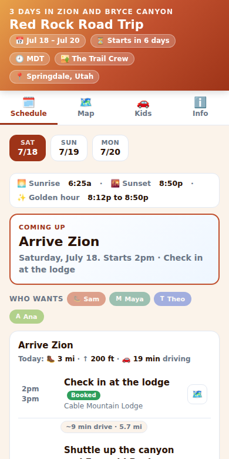
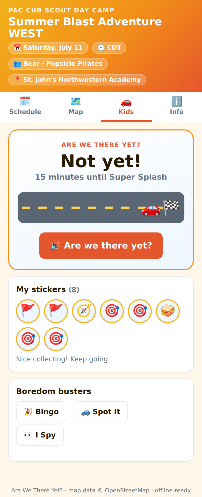
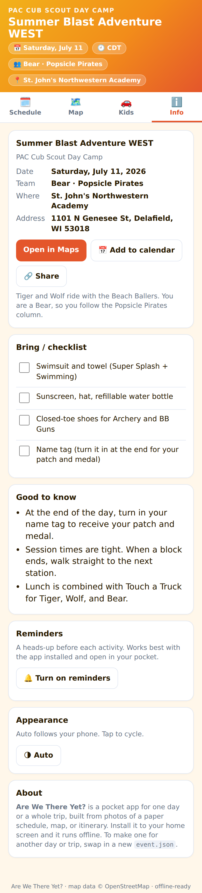
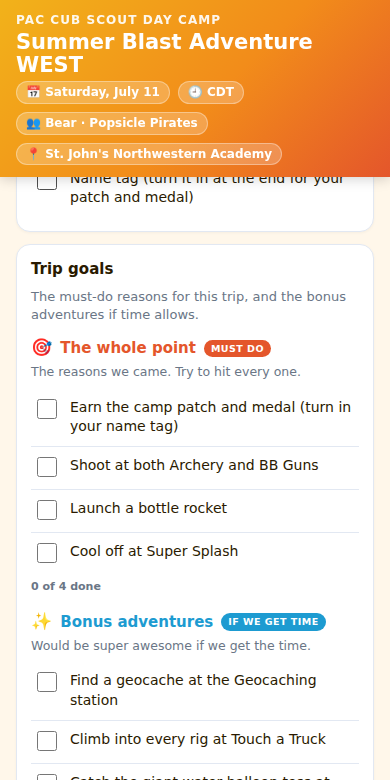
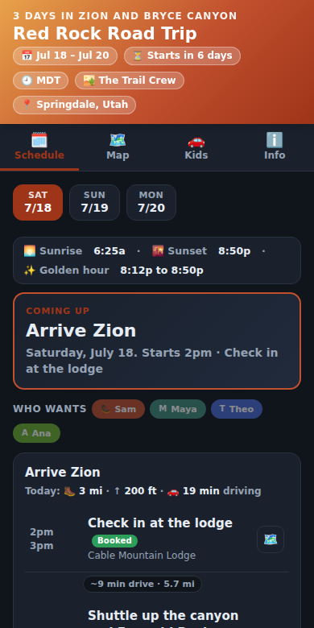

# Are We There Yet?

A drop-in pocket app for a single day or a whole trip. Point Claude at
photos of a paper schedule, an event map, or a printed itinerary, and it
fills in one `event.json`. The app renders that into an installable PWA with
a live schedule, an arrival countdown and progress bar, a map with find-me
GPS, and an offline itinerary. It runs fully offline once installed, so it
works in a field or a national park with no signal.

This began as a fork of Operation Callahan (a one-off Cedar Point trip app)
and grew into a reusable thing for any day-to-week outing. The name is the
question every kid asks from the back seat.

## The idea

The app code never changes. A single `event.json` describes the whole thing:
title, dates, timezone, location with GPS, the schedule (one day or many),
and every place on the map. Swap that one file and you have a different event.

The hard part, turning a photographed schedule, map, or itinerary into clean
structured data with real GPS coordinates, is done by Claude (or any capable
AI). See [NEW-EVENT.md](NEW-EVENT.md) for the exact workflow and prompt.

```
  📷 photos of schedule / map / itinerary  ->  🤖 Claude OCR + geocode  ->  event.json  ->  📱 installable PWA
```

## One day or many

- **Single day** (a camp, a conference, a wedding): one date, one schedule.
  The bundled `event.json` is the Bear (Popsicle Pirates) track at PAC Summer
  Blast Adventure WEST, St. John's Northwestern Academy, Delafield WI.
- **Multi-day** (a vacation, a road trip, a festival weekend): a `days[]`
  array, each with its own date, schedule, and places. A day switcher appears,
  the header shows "Day 2 of 5" or a countdown to the trip, and the map
  filters to the selected day. See
  [`samples/vacation.json`](samples/vacation.json) for a 3-day Door County
  example.

Single-day files need no `days[]`. A flat top-level `schedule` is treated as
a one-day trip, so old files keep working.

## What the app does

Three tabs, no backend, no build step.

- **Schedule** - A live "right now / up next" banner with a countdown, a
  "how much of the day is done" progress bar, and the day as a timeline. On
  the event day it opens focused on the current block, highlights it, and dims
  finished ones. A pulsing "up in 5 minutes" nudge tells you when to move, and
  optional reminders can notify you before each activity. Every block links to
  its spot on the map with one-tap walking directions. On trips, a day
  switcher scrolls across the top.
- **Map** - A Leaflet map with a colored pin for every stop (activities, food,
  lodging, sights, services). "Find me" drops your live GPS and names the
  nearest stop, "Mark my car" saves where you parked, "Save offline" caches
  the visible tiles so the map keeps working with no signal, and tapping any
  pin lets you jot a note.
- **Kids** - The back-seat tab that earns the app its name. A big glanceable
  "Are we there yet?" answer with a car driving along a road toward the finish,
  a kid-worded countdown ("7 minutes until Bottle Rockets"), and a talking
  button that says the answer out loud. Kids collect a sticker for every stop
  they reach (with confetti), and three offline boredom-busters are built in:
  Bingo, Spot It, and I Spy.
- **Info** - Location and Open-in-Maps, an Add-to-Calendar export (.ics), a
  Share button, where you're staying, a reservations tracker, a saved packing
  checklist, trip goal lists, live weather, reminder controls, a light/dark
  appearance toggle, and good-to-know notes.
- **Trip goals** - Two saved checklists on the Info tab that split the trip
  into what matters. A "must-do / the whole point" list for the reasons you
  came, and a "would-be-awesome / bonus adventures" list for the stops you'll
  hit if time allows or another adventure brings you close. Each shows a
  little "3 of 4 done" progress line, and ticks stay checked offline like the
  packing list. Both are optional and data-driven from `event.json`.
- **Reservations and tickets** - An optional `bookings` list on the Info tab
  for the things that have to be worked out ahead of time: tour tickets, dinner
  seatings, ferries, permits. Each shows a status pill (confirmed, to book, or
  waitlist), an optional book-by deadline that turns amber as it nears and red
  when it's overdue, plus confirmation numbers, a booking link, and directions.
  A header count keeps "3 still to book" in front of you, and checking one off
  stays checked offline. Fully optional and data-driven.
- **Drive-time and timing check** - Between consecutive stops the Schedule tab
  shows a rough "~24 min drive" (or walk) chip, computed offline from the stops'
  coordinates with a road-factor fudge, no routing API and no signal needed. When
  a leg does not fit the gap between two stops it turns red and a "Timing check"
  card calls out the days where two things are too far apart to share. Tune it
  with an optional `travel` block, or leave it to sensible defaults.
- **Opening hours** - Give a stop an open window (`open` on a place, or
  `window`/`earliest`/`latest` on a schedule item) and the Schedule tab shows a
  clock pill: neutral when the planned start is inside the window, red when it is
  outside. On the current day the live card and the up-in-5 nudge warn when the
  plan would arrive outside the window. Fully optional and data-driven.
- **Flex replan** - Mark a block `flex: true` and it can slide when you run
  behind; everything else stays anchored (a booked, fixed-time thing). When the
  day slips, the "right now" card offers to push the flexible blocks by +15/+30/+60
  and names the tradeoff: which fixed blocks you still make and which are now at
  risk ("push the beach an hour and you still make the fish boil, but the
  lighthouse tour is at risk"). Schedule rows show a Flex or Fixed pill and a
  projected-time badge. It never rewrites your plan, remembers the slip per day
  offline, and a confirmed booking keeps its block anchored. Fully optional.
- **Who wants what** - List your group in `team.members[]`, then tag schedule
  items, trip goals, and bookings with a `who`. The app shows small initial chips
  per person (colors derived offline from the name) and a filter above the
  Schedule and Trip goals: pick a person to see just their wants, or "Everyone
  agrees" to see only what the whole group is on. Fully optional; nothing shows
  until there are two or more members.
- **Sun times and golden hour** - Sunrise, sunset, and the evening golden hour
  for the selected day, computed offline from the location's coordinates with no
  API, so they work in a canyon with no signal.
- **Weather-aware plan** - The forecast we already fetch becomes signal: a "pack
  the rain shell" hint on rainy days, and a "🌧 60%" badge on any block whose
  hours line up with high rain odds, so you can move the outdoor stuff.
- **Trail stats** - Optional `dist`, `gain`, and `level` on a schedule item show
  a distance / elevation / difficulty line and add up to a "Today: 11.4 mi,
  1,750 ft" glance under the heading.
- **Map route** - The Map draws the day's stops as an ordered line and shows the
  day's total driving time, so a scatter of pins reads as an actual route.
- **Quality-of-life** - The Schedule opens on your current block and floats a
  "Now" pill to jump back to it, the active "Who wants" filter shows a clear
  banner, and every animation respects your reduce-motion setting.

Times respect the event's `timezone`, so a trip in another zone still shows
the right clock. The whole thing installs to the home screen and works offline.

## Screenshots

| Schedule | Kids mode |
|:--:|:--:|
|  |  |
| **Info** | **Trip goals** |
|  |  |
| **Dark mode** | |
|  | |

Regenerate them anytime with `npm run shots` (or `node screenshots.js`). The
script serves the repo, drives each tab, and writes the PNGs to `docs/`. Run
it with a network connection and it also captures the Map tab (Leaflet and
OpenStreetMap tiles need to load).

## Run it locally

Plain static HTML. No npm needed to run it.

```
npx serve .
# or
python -m http.server 8000
```

Then open `http://localhost:8000`. Geolocation works on `localhost` and on
HTTPS (like GitHub Pages), but browsers block it on plain `file://` URLs.

To preview the multi-day sample: `cp samples/vacation.json event.json` (then
restore with git when done).

## Deploy to GitHub Pages

Pages is HTTPS, so GPS, reminders, and installability all work with no backend.

1. Push to `main`.
2. In the repo, go to **Settings > Pages > Build and deployment**.
3. Set **Source** to "Deploy from a branch", pick `main`, folder `/ (root)`,
   and **Save**.
4. Wait about a minute. The live URL is `https://<user>.github.io/<repo>/`.

The `.nojekyll` file disables Jekyll so `assets/` serves. Keep it.

## A note on reminders

Reminders are best-effort local notifications: they fire while the installed
app is running or recently backgrounded, with no server involved. Always-on
push (delivered hours later with the app fully closed) would need a small
backend with the Web Push protocol, which this static app intentionally does
not include.

## Make it your own day or trip

1. Read [NEW-EVENT.md](NEW-EVENT.md).
2. Photograph the schedule, map, or itinerary.
3. Hand the photos to Claude with the prompt in that file. You get a fresh
   `event.json` (single-day or multi-day).
4. Drop it in, bump `CACHE` in `sw.js`, update `manifest.json`, and redeploy.

## Files

| File | What it is |
|------|------------|
| `index.html` | The entire app: shell, three tabs, map, live clock, day switcher, timezone logic, PWA wiring. Data-driven, never edited per event. |
| `event.json` | The one file that describes a day or a trip. Swap this to change events. |
| `samples/vacation.json` | A 3-day multi-day trip example. |
| `manifest.json` | PWA metadata (name, icons, colors). |
| `sw.js` | Service worker. Caches the shell, `event.json`, and any tiles you save offline. |
| `gen-icons.js` | Regenerates the app icons via Playwright. |
| `screenshots.js` | Captures the `docs/` screenshots via Playwright (`npm run shots`). |
| `NEW-EVENT.md` | How to turn photos into a new `event.json` with Claude. |
| `SPEC.md` | The `event.json` schema, field by field. |
| `.nojekyll` | Lets GitHub Pages serve the `assets/` folder. |

## Credits

- Weather via [Open-Meteo](https://open-meteo.com/) (no API key)
- Map tiles (c) [OpenStreetMap](https://www.openstreetmap.org/copyright) contributors
- Map rendering by [Leaflet](https://leafletjs.com/) 1.9.4
